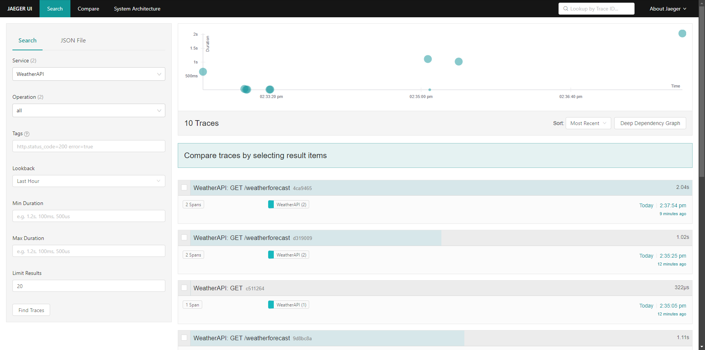

Jaeger is an open-source, end-to-end distributed tracing system designed to monitor and troubleshoot microservices-based applications. It helps developers:
1. Monitor request latencies.
1. Understand service dependencies.
1. Trace performance bottlenecks.

Запускаем контейнер с jaeger

``` docker
docker run --name jaeger \
  -p 13133:13133 \
  -p 16686:16686 \
  -p 4317:4317 \
  -d --restart=unless-stopped \
  jaegertracing/opentelemetry-all-in-one:latest
```

### Пример запросов к web api в jaeger
